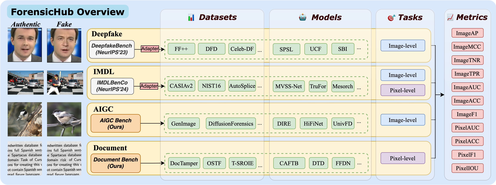

# ForensicHub: A Unified Benchmark & Codebase for All-Domain Fake Image Detection and Localization

**ForensicHub** is the go-to benchmark and modular codebase for all-domain fake image detection and localization,
covering deepfake detection (Deepfake), image manipulation detection and localization (IMDL), artificial
intelligence-generated image detection (AIGC), and document image manipulation localization (Doc). Whether you're
benchmarking
forensic models or building your own cross-domain pipelines, **ForensicHub** offers a flexible, configuration-driven
architecture to streamline development, comparison, and analysis.

🕵️‍♂️ **ForensicHub provides four core modular components:**

### 🗂️ Datasets

Datasets handle the data loading process and are required to return fields that conform to the ForensicHub
specification.

### 🔧 Transforms

Transforms handle the data pre-processing and augmentation for different tasks.

### 🧠 Models

Models, through alignment with Datasets and unified output, allow for the inclusion of various
state-of-the-art image forensic models.

### 📊 Evaluators

Evaluators cover commonly used image- and pixel-level metrics for different tasks, and are implemented with GPU
acceleration to improve evaluation efficiency during training and testing.



## 📁 项目核心结构

```bash
ForensicHub/
├── common/                 # 基本模块
│   ├── backbones/          # backbones和feature extractors
│   ├── evalaution/         # image-, pixel-level evaluators
│   ├── utils/              # 工具包
│   └── wrapper/            # 提供封装dataset、model等wrapper
├── core/                   # 核心模块，提供各组件抽象基类
├── statics/                # 存放训练和测试启用yaml配置文件
├── tasks/                  # 实现各任务不同组件
│   ├── aigc/           
│   ├── deepfake/             
│   ├── document/            
│   └── imdl/     
└── training_scripts        # 模型训练和测试
```

## Installation

---

我们提供两种方式使用ForensicHub，通过Python Package安装，或者通过Clone项目到本地。

### Python Package
With `pip` :
```
TBD
```
With `conda` :
```
TBD
```

### Clone
直接命令行输入：
```
git clone https://github.com/scu-zjz/ForensicHub.git
```

## Quick Start

---

我们提供的Quick Start是基于Clone项目到本地的运行方式。ForensicHub是一个模块化和配置化的轻代码框架，因此您只需要使用框架现有的或者自定义自己的**Dataset,Transform and Model**并注册，然后直接通过Yaml配置文件运行。下面提供Yaml配置文件的具体信息，如何注册您自己的**Dataset,Transform and Model**组件可以在文档中找到。

训练阶段Yaml，其中**Model, Dataset, Transform, Evaluator**四个组件均可以实现用`init_config`方式配置类的初始化参数：
```
# DDP
gpus: "4,5"
flag: train

# Log
log_dir: "./log/aigc_resnet_df_train"

# Task
if_predict_label: true
if_predict_mask: false

# Model
model:
  name: Resnet50
  # Model specific setting
  init_config:
    pretrained: true
    num_classes: 1

# Train dataset
train_dataset:
  name: AIGCLabelDataset
  dataset_name: DiffusionForensics_train
  init_config:
    image_size: 224
    path: /mnt/data1/public_datasets/AIGC/DiffusionForensics/images/train.json
#  Test dataset (one or many)
test_dataset:
  - name: AIGCLabelDataset
    dataset_name: DiffusionForensics_val
    init_config:
      image_size: 224
      path: /mnt/data1/public_datasets/AIGC/DiffusionForensics/images/val.json

# Transform
transform:
  name: AIGCTransform

# Evaluators
evaluator:
  - name: ImageF1
    init_config:
      threshold: 0.5

# Training related
batch_size: 768
test_batch_size: 128
epochs: 20
accum_iter: 1
record_epoch: 0  # Save the best only after record epoch.

# Test related
no_model_eval: false
test_period: 1

# Logging & TensorBoard
log_per_epoch_count: 20

# DDP & AMP settings
find_unused_parameters: false
use_amp: true

# Optimizer parameters
weight_decay: 0.05
lr: 1e-4
blr: 0.001
min_lr: 1e-5
warmup_epochs: 1

# Device and training control
device: "cuda"
seed: 42
resume: ""
start_epoch: 0
num_workers: 8
pin_mem: true

# Distributed training parameters
world_size: 1
local_rank: -1
dist_on_itp: false
dist_url: "env://"
```

配置Yaml文件后，可以通过`statics/run.sh`修改文件路径后启动，也可以通过`statics/batch_run.sh`批量启动。后者是直接通过批量调用前者脚本实现。测试的Yaml配置同理，同样仅需配置四个组件，具体请见`statics`下的脚本。


## Citation

```
@misc{du2025forensichubunifiedbenchmark,
      title={ForensicHub: A Unified Benchmark & Codebase for All-Domain Fake Image Detection and Localization}, 
      author={Bo Du and Xuekang Zhu and Xiaochen Ma and Chenfan Qu and Kaiwen Feng and Zhe Yang and Chi-Man Pun and Jian Liu and Jizhe Zhou},
      year={2025},
      eprint={2505.11003},
      archivePrefix={arXiv},
      primaryClass={cs.CV},
      url={https://arxiv.org/abs/2505.11003}, 
}
```

[//]: # (## 开发用链接：)

[//]: # (- [文档Github仓库]&#40;https://github.com/scu-zjz/ForensicHub-doc&#41;)

[//]: # (- [文档的主页]&#40;https://scu-zjz.github.io/ForensicHub-doc/&#41;)

[//]: # (- [PyPi]&#40;https://pypi.org/project/forensichub/&#41;)

[//]: # (## Reference链接)

[//]: # (- [DeepfakeBench原生仓库]&#40;https://github.com/SCLBD/DeepfakeBench&#41;)

[//]: # (- [DeepfakeBench我们版本]&#40;https://github.com/scu-zjz/DeepfakeBench&#41;)

[//]: # (- [AIGCBench]&#40;https://github.com/Ekko-zn/AIGCDetectBenchmark?tab=readme-ov-file&#41;)

[//]: # ()

[//]: # (## Local install)

[//]: # (本地开发者安装（实时更新）)

[//]: # (需要先切换到clone下来的ForensicHub的路径下，然后执行如下命令)

[//]: # (```shell)

[//]: # (pip install -e .)

[//]: # (```)

[//]: # (目前pypi仅仅用于站坑，暂时不要从pypi直接安装。)

[//]: # ()

[//]: # (## One-line Training/testing)

[//]: # (```)

[//]: # (forhub train /mnt/data0/xiaochen/workspace/fornhub/ForensicHub/ForensicHub/statics/aigc/train_resnet.yaml)

[//]: # (```)

[//]: # ()

[//]: # (```)

[//]: # (forhub test /mnt/data0/xiaochen/workspace/fornhub/ForensicHub/ForensicHub/statics/aigc/test_resnet.yaml)

[//]: # (```)

[//]: # ()

[//]: # (## IMDLBenCo式的代码生成和Training)

[//]: # (找一个干净的工作路径，然后执行如下指令：)

[//]: # (```)

[//]: # (forhub init)

[//]: # (```)

[//]: # ()

[//]: # (这样就会在这个路径下生成所需的yaml和shell脚本，其中`run.sh`作为全局入口，这个模式鼓励任意修改代码。)

[//]: # ()

[//]: # (后续可能会添加`forhub init imdl` `forhub init aigc`这样的分支入口应对不同的情况。)

[//]: # ()

[//]: # (## Command Line)

[//]: # (查看版本)

[//]: # (```)

[//]: # (forhub -v )

[//]: # (```)

[//]: # ()

[//]: # (初始化（目前没有实现功能）：)

[//]: # (```)

[//]: # (forhub init)

[//]: # (```)

[//]: # ()

[//]: # ()

[//]: # (## TODO list)

[//]: # (- [ ] 完善文档)

[//]: # (- [ ] 确定所有CMD的功能和接口API形式)

[//]: # (- [ ] 缝合朱哥的Deepfake部分)

[//]: # (- [ ] 测试image-level的F1分数。)

[//]: # ()

[//]: # (## Repo Structure:)

[//]: # (- common # 通用组件)

[//]: # (- core # 核心组件，用户接入时需要继承base_dataset,base_model,base_transform三个组件并注册，用户需要自己保证使用的dataset输出与model的输入对应)

[//]: # (- tasks # 不同垂类任务的组件库)

[//]: # (- training_scripts # 训练和测试入口，以yaml格式配置管理，统一入口为run.sh)
